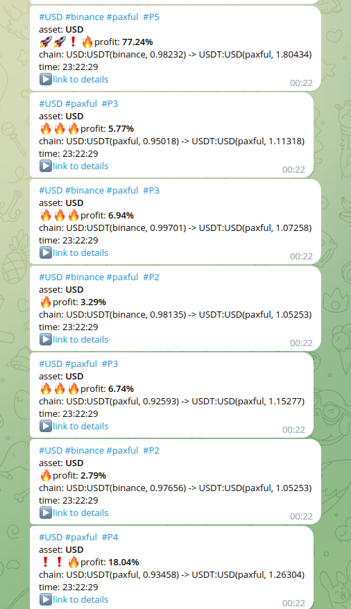

## !!!! Only for demo purposes

This service consumes P2P orders preliminary uploaded from a lot of crypto exchanges to `Aerospike` and builds sets of arbitrage chains.

`Arbitrage chain` is a sequence of orders to be closed in order to make a profit at the end of the chain , e.g.

````
USDT -> BTC
BTC  -> ETH
ETH  -> USDT
````
Authorized users are able to consume prepared chains by subscribing to the Telegram channels.

Telegram channels notification can be configured by specifying filters which are supposed to be applied to the resulted chains.


